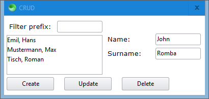

# Sciter 7GUIs

[7GUIs](https://eugenkiss.github.io/7guis/tasks) benchmarks implemented in [Sciter](https://github.com/c-smile/sciter-sdk).

Run the implementations by placing [scapp.exe](https://github.com/c-smile/sciter-sdk/tree/master/bin.win/x64) in this folder and running the appropriate `.bat` file.

## Counter

:construction: Not yet implemented. :construction:

## Temperature Converter

:construction: Not yet implemented. :construction:

## Flight Booker

:construction: Not yet implemented. :construction:

## Timer

:construction: Not yet implemented. :construction:

## CRUD

:construction: Not yet implemented. :construction:

## Circle Drawer

:construction: Not yet implemented. :construction:

## Cells

:construction: Not yet implemented. :construction: