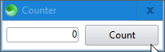
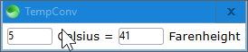
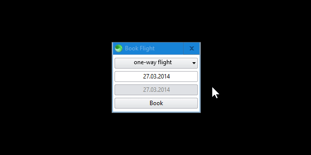
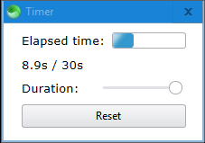
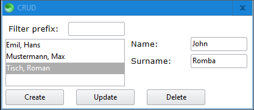
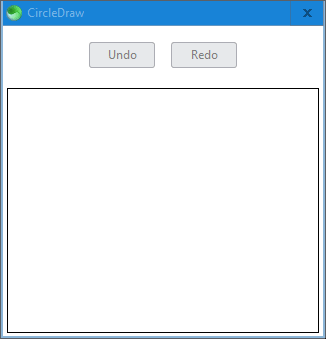

# Sciter 7GUIs

[7GUIs](https://eugenkiss.github.io/7guis/tasks) benchmarks implemented in [Sciter](https://github.com/c-smile/sciter-sdk).

Run the implementations by placing [scapp.exe](https://github.com/c-smile/sciter-sdk/tree/master/bin.win/x64) in this folder and running the appropriate `.bat` file.

## Counter

## Temperature Converter

## Flight Booker

:construction: Under construction (indefinitely). :construction:

## Timer

## CRUD

## Circle Drawer

## Cells

:construction: Not yet implemented. :construction: